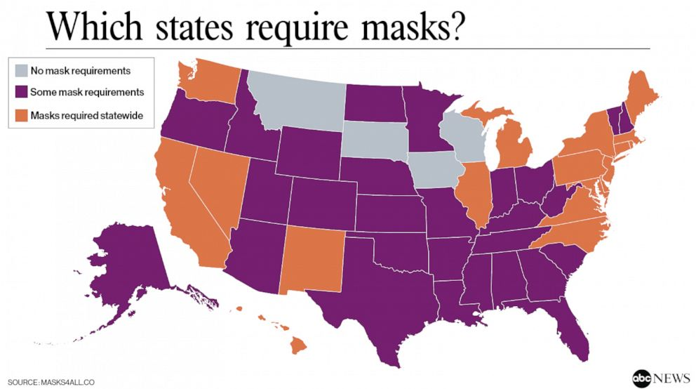

```{r setup, include=FALSE}
knitr::opts_chunk$set(echo = TRUE)
```
\newpage

\newpage

## 1. Introduction
COVID-19 has been an emerging and rapidly evolving enemy that the world is fighting with. It was on Feb 6th 2020 that the United States saw its first covid-19 related death and ever since then the nation has been at unrest. The onset of the virus has since completely altered the ways in which people interact with each other and in public spaces. The purpose of this lab exercise is to investigate the cause of variation in infections across the 50 states (and 1 special district) with the emphasis on the public policies, while controlling for other demographic parameters.

The policy response to COVID-19 in the United States was fundamentally different as compared to how the rest of the world responded. More autonomy was given to each state, which resulted in  great variation in the enforcement as well as timing of key public policies to control the spread of viruses. One such variation was in declaring "wearing mask" as mandatory, one of the primary ways to slow down the spread. While 16 states implemented the policy as early as in April and many followed suit by late June,  9 states were still evaluating the effectiveness of a mandatory mask-wearing policy as of early July. Therefore, an important question is how much enforcement of wearing masks in public areas helps contain the spread of the viruses while other policy and demographic features, such as proportion of below-poverty level population and proportion of seniors (age 65+), are at play.

Specifically, we are hypothesizing a casual relationship between states enforcing the mandatory mask-wearing policy and controlling the spread of COVD-19. Our research question thus is:


**How much does a mandatory mask-wearing policy slow the spread of COVID-19 while accounting for the demographic feature variation such as density, poverty or susceptible population?**

The dataset for this research was compiled on July 6th from surveys and census. Due to a few issues noted with the data, data cleansing and transformation were performed to prepare for model fitting. No additional variables were added.

<b>Potential issues with the dataset:<b>
* There might be important variables missing from the dataset which might affect our conclusions. We will discuss this more under the "omitted variable" section.
* Many data points about demographic features, such as "population proportion" were collected "point-in-time" in 2018 or earlier. While they represent the best data available, these constraints may affect the accuracy of our explanation. Due to the constraints and the complexity of the issue, we are not attempting to predict the number of increases in cases but focusing on explaining the increase in the number of infections.

In the next section, we discuss the data cleansing and transformation performed.
 
## 2. Data Preparation
This section of the report focuses on preparing the data for exploratory analysis and model building.

### 2.1 Importing libraries and data

The code below calls for the necessary libraries such as dplyr (a data manipulation library), ggplot2 (plotting library), caret (modeling library), stargazer (charting and table library) so and so forth. It also reads in the data and renames the columns for further exploration.

```{r warning=FALSE,message=FALSE }
library(ggplot2)
library(dplyr)
library(stringr)
library(stargazer)
library(stats)
library(sandwich)
library(caret)
library(car)
library(gridExtra)
library(corrplot)
library(lmtest)
library(knitr)

options(warn = -1)
options(scipen = 999)

#adding theme function for plotting purposes
theme_plot = function(...){
  theme_minimal()+
    theme(
      text = element_text(color = "#22211d"),
      plot.title = element_text(hjust = 0.5, color = "#4e4d47"),
      plot.subtitle = element_text(hjust = 0.5, color = "#4e4d47", 
                                   margin = margin(b = -0.1, 
                                                   t = -0.1, 
                                                   l = 2, 
                                                   unit = "cm"), 
                                   debug = F),
      plot.background = element_rect(fill = "#f5f5f2", color = NA), 
      panel.grid.major = element_line(color = "#ebebe5", size = 0.2),
      legend.text.align = 0,
      legend.text = element_text(size = 7, hjust = 0, color = "#4e4d47"),
      legend.title = element_text(size = 8),
      legend.background = element_rect(fill = "#f5f5f2", color = NA),
      panel.border = element_blank()
      
    )
}

#setting up size of the plots. 
#options(repr.plot.width=8, repr.plot.height=1.5)

df = read.csv("data.csv")

#renaming the columns for ease of reference
colnames(df) = c("state",
                 "tot_case",
                 "tot_death",
                 "death_100k",
                 "cases_7Days",
                 "rateper100k",
                 "testResults",
                 "emergency",
                 "shelter_inplace",
                 "end_shelter",
                 "business_close",
                 "business_reopen",
                 "mandate_mask",
                 "unemp_insurance",
                 "pop_density",
                 "pop",
                 "per_belowpoverty",
                 "per_seriousrisk",
                 "causes_death",
                 "age_0_18",
                 "age_19_25",
                 "age_26_34",
                 "age_35_54",
                 "age_55_64",
                 "age_65_over")
kable(df[1:5,1:8],)
```


```{r warning=FALSE,message=FALSE }
paste("The number of the rows ",dim(df)[1], "and columns ",dim(df)[2])
```

### 2.2 Data Cleansing

There are repeating entries for the state of Arizona: "Arizona" and "arizona", they contain almost identical information except for the number of cases and number of deaths. From arithmetic manipulation, we get that the total death number is $population X death rate$, which comes out to be 1,807, very close to the sum of adding up the "number of deaths" from the 2 rows. We see that the 2 rows should be combined by summing up "number of death" and "number of cases" while keeping all other fields as is. We slice the data for only those entries, sum the total number of cases and deaths, and remove the row of "arizona" from the dataset to avoid duplication and join the "Arizona" row to the previous dataset, using the code below.

```{r warning=FALSE,message=FALSE }
df_ =
  df%>%
  mutate(state = str_to_sentence(state)) %>%
  filter(state=="Arizona") %>%
  mutate(tot_case = sum(tot_case),
         tot_death = sum(tot_death))%>%
  slice(1)%>%
  rbind(df)%>%
  filter(state!="arizona")%>%
  distinct(state, .keep_all = TRUE)
```

Having treated duplicate entries, we looked for missing "values in the dataset and found that there were four columns,"age_0_18", "age_26_34","age_55_64" and "testResults" as shown below, with one missing value in each.

```{r warning=FALSE,message=FALSE }
#check na values.
kable(sort(colSums(is.na(df_)),decreasing = TRUE)[1:4])
```

As we are interested in the age group that's most susceptible to getting seriously sick from COVID-19, which is the population aged 65 and over, there is no need to back fill the missing values for the other age groups.  We do not use "testResults" in our model, and thus there is no need to treat the missing value in this field.  

We also checked for no data for date variables such as declared shelter in place dates or end of shelter in place, we also looked at the declared dates for mandatory mask policies as well. The "missing value" here is denoted as "0" in the dataset. And we found the following missing values:
  
```{r  warning=FALSE,message=FALSE }
paste("Number of 0s in Shelter in place parameter: ", 
      df_%>% 
        filter(shelter_inplace==0)%>% 
        nrow())
paste("Number of 0s in end shelter parameter: ",
      df_%>%
        filter(end_shelter ==0)%>% 
        nrow())
paste("Number of 0s in end shelter parameter: ",
      df_%>% 
        filter(mandate_mask ==0)%>% 
        nrow())
```


Upon further investigation we found that the declaration of shelter in place or mandatory mask restriction weren’t imposed uniformly across the country. Seven States including Arkansas did not declare shelter in place  [source](https://www.nwahomepage.com/news/a-closer-look/a-closer-look-7-states-with-no-shelter-in-place-order-overview/)


Similarly, four states have yet not declared wearing a mask as a requirement which includes Montana, South Dakota, Iowa and Wisconsin, only 15 states as shown in the map have made wearing a mask mandatory for all rest is required only by essential workers. Therefore, based on our investigation we decided to * impute the date where 0’s exist * to be able to model the effect of such differences on the number of cases. The objective of the imputation is to be able to calculate "shelter in place" period and "maskDays" for all jurisdictions. To minimize distortion to the data, our final imputation depends on the indicators if there is a policy in place or not.


Based on this investigation we created three lists, namely:

1. No shelter list: for states that did not declare the shelter in place

2. No mask list: for states that have still not declared mandatory masks in public policy.

3. Mandatory mask list: only for states that have declared mandatory masks in public policy.

Based on the above three list we decided to do the following imputations:

* If the state is in the "no shelter in place" list, impute "start shelter", "end shelter" and "shelter period" variables to be 0. This means there is never "shelter in place", which meets our objective.

* If the state is not in the "no shelter in place" list, and if the "start shelter" date field is 0, impute "start shelter" as the date the state declared "emergency". Otherwise, take the value provided from the dataset. Here, we used a proxy for the "shelter start date" and may cause "shelter in place" periods to be longer than it actually is for the imputed values. However, we expect the impact to be minimal since most states that adopted a "shelter in place" policy implemented it within 2 weeks of declaring "emergency".

* If the state is not in the "no shelter in place" list, and if the "end shelter" date field is 0, impute "end shelter" as of the "data collection date", or 7/6/2020. This means the state has not ended the "shelter in place" policy yet. We use "data collection date" as a proxy in order to calculate "shelter period". And, the imputed "shelter in place" for those states would be the longest among the dataset since they have not ended the policy yet. However, it may cause the imputed "shelter in place" to be shorter than it actually is, but still correct in direction.  Otherwise, take the value provided from the dataset.

* If the "mandate mask" date field is 0, it means either the state does not have a mandatory mask policy or the data is missing. Per our discussion above, we validated that these states did not have a mandatory mask policy. Thus, we imputed the date as "data collection date" to calculate the "wait period" for a state to implement the "mask" policy. The imputation will result in the longest "wait period" for states that have not implemented the mandatory mask policy, which is correct in direction. However, the imputed "maskDays" may be shorter than it actually is since those states might not have implemented the policy even as of the date of this report.

The code below is used to backfill the missing dates per the rationale above.

```{r  warning=FALSE,message=FALSE  }
noshelterlist = c("Arkansas","Iowa","Nebraska",
                  "North Dakota","South Dakota",
                  "Utah","Wyoming")

nomask = c("Montana","South Dakota","Iowa", "Wisconsin")

maskmandated = c("Washington","California",
                 "Nevada","New Mexico",
                 "Illinois", "Pennsylvania",
                 "New York", "Michigan",
                 "Virginia", "North Carolina",
                 "Maryland","Rhode Island",
                 "Connecticut","Massechusetts",
                 "Maine")

df_ = 
    df_ %>%
    mutate(noshelter = ifelse(state %in% noshelterlist, 1, 0),
           masktype = ifelse(state %in% nomask, 1,
                             ifelse(state %in% maskmandated,2,3)))

df_ =
  df_ %>%
  mutate(shelter_inplace = ifelse(state %in% noshelterlist,"0",
                                  ifelse(as.character(shelter_inplace)=="0",
                                         as.character(emergency),
                                         as.character(shelter_inplace))),
         end_shelter = ifelse(state %in% noshelterlist,0,
                              ifelse(as.character(end_shelter)=="0",
                                     "7/6/2020",
                                     as.character(end_shelter))),
         mandate_mask = ifelse(as.character(mandate_mask)=="0",
                               "7/6/2020",
                               as.character(mandate_mask)))

kable(df_[1:5,(ncol(df_)-7):ncol(df_)],)
```

Then the imputed date parameters were converted to number of days variables to understand the effect on the number of infections. The date variables, government interventions in response to COVID-19, were converted into following:

*   shelterperiod: Duration of shelter-in-place orders: Operationalized as number of days between end of shelter in place and when shelter in place was declared.

*   MaskDays: Delay in states declaring mask-usage mandates from the date of emergency.

We did not use the emergency date to create "Days to Declare Emergency" variables as most states declared the state of emergency within a roughly two week time frame, and such a short duration wouldn't lead to enough variation as a parameter.

The code below is used to calculate the "shelterperiod" and "MaskDays".


```{r  warning=FALSE,message=FALSE }
df_ =
  df_ %>%
  mutate(shelterperiod = ifelse(noshelter==1,0,
                                as.Date(end_shelter,"%m/%d/%y") - 
                                  as.Date(shelter_inplace,"%m/%d/%y")),
         maskDays = as.numeric(as.Date(mandate_mask, "%m/%d/%y") - 
           as.Date(emergency, "%m/%d/%y"),units="days")) %>%
  select(-emergency,-shelter_inplace,-end_shelter,-mandate_mask,
         -business_close,-business_reopen)

kable(df_[1:5,(ncol(df_)-7):ncol(df_)],)
```

Having treated data issues, we'll move on to data exploration in the next section.
\newpage

## 3. Exploratory Analysis

In this section of the report we explore the dataset to identify patterns based on analysis and see if there is any need for further transformations or need to drop entries from the dataset.

### 3.1. Log Transformations
We plotted the identified dependent variables **Cases_7Days** (left chart) to understand the distribution. The distribution shows a non-normal behavior and in fact shows positive skewness, to normalize the distribution we took the log of **Cases_7Days** (right chart).

```{r  warning=FALSE,message=FALSE, fig.height = 3}
p = ggplot()+
    geom_histogram(data=df_,
                   aes(cases_7Days),
                           fill="#69b3a2",color="NA")+
  theme_plot()+
  labs(title = "Dependent Variable", 
       subtitle = "Frequency of Number of Cases in each State",
       x="Number of Cases in past 7 Days",
       y="Count")
  
p1 = ggplot()+
     geom_histogram(data=df_,
                    aes(log(cases_7Days)),
                           fill="#69b3a2",
                           color="NA")+
  stat_function(fun = dnorm,color="red", 
                args = list(mean = mean(log(df_$cases_7Days)), 
                            sd = sd(log(df_$cases_7Days))))+
  theme_plot()+
  labs(title = "Dependent Variable", 
       subtitle = "Frequency of Number of Cases in each State",
       x="Number of Cases in past 7 Days (Logged)",
       y="Count")
grid.arrange(p, p1, nrow=1)
```

\newpage

Having identified that the dependent variable needs logarithmic transformation, we also plotted a few key independent variables to observe the distribution. The plot below shows that population density is not normally distributed, and, similar to **cases_7Days**,  has a positive skewness. So we log transformed the population density variable as well to see if that normalizes the distribution (right chart).

```{r warning=FALSE,message=FALSE, fig.height = 3}
popden = ggplot()+
geom_histogram(data=df_,
              aes(pop_density),
                           fill="#69b3a2",
                           color="NA")+
       theme_plot()+
       labs(
            x="Population Density",
            y="Count")

popdenlog = ggplot()+
geom_histogram(data=df_,
              aes(log(pop_density)),
                           fill="#69b3a2",
                           color="NA")+
       theme_plot()+
       labs(
            x="Population Density",
            y="Count")

grid.arrange(popden, popdenlog, nrow=1)
```

The log transformed distribution looks better.
In addition, in the above chart we can see that there is a single state with a population density of ~12,000 people per acre, which is nearly an order-of-magnitude greater than other states. So we might need to check whether it is an outlier in the dataset.
 
### 3.2. Checking for outliers

```{r warning=FALSE,message=FALSE, fig.height = 4}
fit <- lm(log(cases_7Days) ~ log(pop_density), data=df_)
cutoff <- 4/((nrow(df_)-length(fit$coefficients)-2))
par(bg = '#f5f5f2')
plot(fit, which=4, cook.levels=cutoff, 
     main="Cook's distance plot for the data",
     col="red", 
     axes=FALSE)
at = axTicks(1)
at2 = axTicks(2)
mtext(side = 1, text = at, at = at, col = "black", line = 1)
mtext(side = 2, text = at2, at = at2, col = "black", line = 1)
grid()

kable(df_[25,1:6],)

# Removing DC from the training data
df_ =  df_[!(df_$state == 'District of Columbia'),]
```

By inclusion of DC, the distribution is skewed due to its very high population density. Moreover, all other entries in the data except for DC are states and DC is significantly different from others due to its compact urban-only nature. Therefore, we removed DC from the dataset in the code above.

### 3.3 Checking for Multicollinearity: 

We plotted the scatterplot matrix to understand the relationship between log transformed dependent variables and a few key explanatory variables such as delay in mask days, shelter period, or other demographic variables such as population density(log-transformed) or  percentage below poverty line etc.
```{r warning=FALSE,message=FALSE,fig.align="center",fig.height=6}
scatterplotMatrix(~log(df_$cases_7Days)+df_$maskDays+
                    df_$shelterperiod+log(df_$pop_density)+
                    df_$per_seriousrisk+df_$per_belowpoverty,
                  pch=20 , cex=0.75 , col="#69b3a2",
                  main="Scatterplot Matrix for Covid-19")

```
From the scatter plots above, we see some clear linear relation between "cases_7Days(logged)" and "maskDays" as well as "per_belowpoverty". However, we do not see any perfect multicollinearity among the independent variables.

Further, to err on the "inclusive" side for model 3, we check the multicollinearity with all the variables in the dataset, by plotting a correlation matrix as shown below. This step helps us identify the "highly correlated" variables that should not be both included in our models. We removed "state", "noshelter" and "masktype" from the plot, as "state" is just an identifier and "noshelter" and "masktype" were created to help calculate "shelterinplace" and "maskDays". We also removed the 4 variables with untreated "missing values". As discussed previously, 3 of the variables are related to "age groups" for which we have other age groups in the dataset that can help us explain the age-related variances. For "total testResults", as it is a cumulative count while our dependent variable is "7-day case numbers", it will not have a meaningful interpretation on the variance in the dependent variable, thus it is safe to remove it.

```{r warning=FALSE,message=FALSE, fig.align="center"}
df_corr= 
  df_%>%
  select(-state,
         -noshelter,
         -masktype,
         -age_0_18,
         -age_55_64,
         -age_26_34,
         -testResults
         )
  
corr <- cor(df_corr)


corrplot(corr, method = "color",
         type = "upper", order = "hclust", number.cex = .45,
         addCoef.col = "black", # Add coefficient of correlation
         tl.col = "black", tl.srt = 90,tl.cex = 0.56, # Text label color and rotation
         # Combine with significance
         sig.level = 0.05, insig = "blank", 
         # hide correlation coefficient on the principal diagonal
         diag = FALSE)


df_=
  df_%>%
  select(state,cases_7Days,rateper100k,maskDays,shelterperiod,
       pop_density,per_belowpoverty,
       per_seriousrisk,age_65_over,causes_death)
```
It is worthwhile to note the strong correlation between "population", "causes_death" (number of deaths from all causes in 2018) and the dependent variable. While it is not a perfect multicollinearity, the high correlation is likely driven by higher population rather than any policy intervention. We'll bear this in mind in interpreting statistical and practical significance. Moreover, the age group variables have high negative correlation with each other. This is expected as they are based on percentages that add up to 100%. For example, the correlation between "age 19-24" and "aged 65 and over'' is $-0.61$. It will make the model clearer if we only keep the age group of "aged 65 and over'' in the model. 

\newpage

## 4. Model Building 

### 4.1. Baseline Model

Our dependent variable is $Cases_7Days$. We chose this over "total number of cases" for the following reason.
- To zero in on the effectiveness of the intervention policies. Compared to total case number: “cases per 100K”,  which may show a reverse causal relationship with the implementation of public policies, 7-day case number more clearly shows the effect of a policy intervention.

Next, We fit our model and see that our explanatory value


```{r  warning=FALSE,message=FALSE, fig.height=3}
set.seed(1056)
lm_model = lm(log(cases_7Days)~ maskDays,
                 data=df_)

stargazer(lm_model, 
         type = "text", 
         title="Descriptive statistics", 
         digits=2, 
         out="table1.txt")


ggplot(lm_model)+
  geom_point(aes(x=.fitted, y=.resid))+
  geom_hline(yintercept = 0, coor="red")+theme_plot()+
  labs(title = "Versus Fit plot", 
       subtitle = "Fitted vs Residual plot of regression",
       x="Fitted values",
       y="Residuals")


par(bg = '#f5f5f2',mfrow=c(1,2))
plot(lm_model, which = 2,pch=20,cex=0.95, axes=FALSE,bty='l', main="Normal Q-Q plot")
grid()
at = axTicks(1)
at2 = axTicks(2)
mtext(side = 1, text = at, at = at, col = "black", line = 1)
mtext(side = 2, text = at2, at = at2, col = "black", line = 1)
plot(lm_model, which = 3,pch=20,cex=0.95, axes=FALSE,bty='l', main="Scale-Location")
at = axTicks(1)
at2 = axTicks(2)
mtext(side = 1, text = at, at = at, col = "black", line = 1)
mtext(side = 2, text = at2, at = at2, col = "black", line = 1)
grid()
```

Model 1 Analysis: 


1. From the residuals plot we can see that the fitted values towards the extremes are not distributed randomly around the zero conditional mean.
2. The normal qq plot reveals that the standardized residuals are definitely not normally
distributed, with the tails exhibiting excess kurtosis.
3. The scale-location plot exhibits a red flag on heteroskedasticity, with the square root of the standardized residuals having a distinctly positive bias for lower values on the estimator axis.

Moreover, we used Breusch-Pagan test to test the degree of heteroskedasticity in the sample via hypothesis testing. For this test, the null hypothesis is that the fitted values show homoscedasticity. To our surprise, the p value is high, and we fail to reject the null hypothesis.

```{r}
bptest(lm_model)
```

However, we know that we could not demonstrate homoskedasticity from the "scale-location" plot, to err on the conservative side, we computed heteroskedasticity-robust standard errors to re-evaluate the significance of the identified estimator. We see that p-value is 0.13 and we fail to reject the null hypothesis of the t-test for the significance of the coefficient. it is not significant. On the other hand, the naive standard errors were in fact too small since they rely on the assumption of homoscedasticity.

```{r}
coeftest(lm_model, vcov = vcovHC)
(se.lm_model = sqrt(diag(vcovHC(lm_model))))
```


However, we only just used one variable to explain the variation in the number of 7-day cases. We know that there are key covariates we haven't yet considered that may improve the significance of the estimates. We'll use our background knowledge and introduce more covariates in the next sections.

\newpage

### 4.2. Improvement Model 

In this 2nd model, we included demographic features, such as population density and proportion of the population at risk into the equation. These features are believed to have an impact on the case number and we will test these hypotheses. In addition, we included another key public policy, "shelter in-place", in the model to test if this policy has a significant impact. Below is a summary of all the independent variables for model 2.

<b>Independent Variables</b>:
  + **Duration of mandated face-masks in days (as of Emergency day)**: Variable type (Integer); The first policy decision that we examine is the mandated face-mask duration across states. We expect the mandated face mask duration to be one of the important predictors of infection rate given Covid19 is contagious disease.
  + **Duration of shelter in place order in days (using the end of Shelter in place)**: Variable type (Integer); The second policy decision that we examine is the shelter in place order duration across states. We want to check if we see a statistically significant impact of shelter in place duration on the infection rate.
  + **Population density per square mile**: Variable type (real number); after controlling for the state policies, we expect population density to be another important predictor of the infections as it's an infectious disease spread via human contact.
  + **Percent at risk for serious illness due to covid**: Variable type (real number between 0-100); We expect that along with population density the percent of susceptible population for this highly contagious disease will play an important role in understanding the variation in the infections.
  + **Percent living under federal poverty line**: Variable type (real number between 0-100); Despite the shelter in place order, only a certain section of the US workforce was able to work from home. With certain sections of society dependent on day-to-day ways we are expecting that the population living below the poverty line would be more susceptible to infections as they would take disproportionate risk and potentially expose themselves.

Below we fit model 2 and plotted a few charts to make further evaluation of the model fitness.


```{r  warning=FALSE,message=FALSE, fig.height=3}
set.seed(1056)
lm_model2 = lm(log(cases_7Days)~ maskDays+ shelterperiod + log(pop_density) + 
                 per_belowpoverty +per_seriousrisk,
                 data=df_%>%select(-state))

stargazer(lm_model2, 
          type = "text", 
          title="Descriptive statistics", 
          digits=2, 
          out="table1.txt")

rs=ggplot(lm_model2)+
  geom_point(aes(x=.fitted, y=.resid))+
  geom_hline(yintercept = 0, color="red")+theme_plot()+
  labs(title = "Versus Fit plot", 
       subtitle = "Fitted vs Residual plot of regression",
       x="Fitted values",
       y="Residuals")

df_pred = df_ %>%
  select(state,cases_7Days,maskDays)%>%
  mutate( dependent = log(cases_7Days),
          predicted = predict(lm_model2),
          residual = residuals(lm_model2))

ft= ggplot(df_pred, aes(x = predict(lm_model2)  , y = log(cases_7Days)))+
    geom_point()+
    geom_smooth(method="lm", color="red")+
    theme_plot()+
    labs(title = "Fitness plot", 
         subtitle = "Original vs Predicted values",
         x="Predicted number of cases",
         y="Number of cases in past 7-Days (logged)")
grid.arrange(rs,ft, nrow=1)


par(bg = '#f5f5f2',mfrow=c(1,2))
plot(lm_model2, which = 2,pch=20,cex=0.95, axes=FALSE,bty='l', main="Normal Q-Q plot")
grid()
at = axTicks(1)
at2 = axTicks(2)
mtext(side = 1, text = at, at = at, col = "black", line = 1)
mtext(side = 2, text = at2, at = at2, col = "black", line = 1)
plot(lm_model2, which = 3,pch=20,cex=0.95, axes=FALSE,bty='l', main="Scale-Location")
at = axTicks(1)
at2 = axTicks(2)
mtext(side = 1, text = at, at = at, col = "black", line = 1)
mtext(side = 2, text = at2, at = at2, col = "black", line = 1)
grid()
```

Analysis of Model 2: 

1. The residuals plot seems to have a conditional mean near zero for most values of the estimators.

2. The normal qq plot reveals that the standardized residuals are for most part normally distributed except at the tails. Although, the deviation shown here is definitely lesser than in the baseline model, it still exhibits kurtosis.

3. The scale-location plot exhibits a potential heteroskedasticity, with curvature that may be influenced by sparse observations around the extrema of the estimator.

By computing the Breusch-Pagan test, contrary to our observation above, we were unable to reject the null hypothesis due to the high p-value.
```{r}
bptest(lm_model2)
```

Similar to model 1, we could not demonstrate "homoscedasticity" from the plot, and will still use the "robust standard error" to make our estimate more robust.
By computing the  heteroskedasticity-robust standard errors test we were able to re-evaluate the significance of the estimators in the model and we see that despite of the use of the "robust standard errors", there is dramatic improvement in the model as compared to the baseline model with maskDays being statistically significant at 5%.


```{r}
coeftest(lm_model2, vcov = vcovHC)
(se.lm_model2 = sqrt(diag(vcovHC(lm_model2))))
```

\newpage

### 4.3 Improvement Model 3

In this section, we are running a "kitchen sink" model to check if there are other covariates that might explain the variation in 7-day case number. We fit model 3 below.
```{r warning=FALSE,message=FALSE, fig.height=3}
set.seed(1056)
lm_model3 = lm(log(cases_7Days)~ maskDays+ shelterperiod + log(pop_density) + 
                 per_belowpoverty +per_seriousrisk+age_65_over+causes_death,
                 data=df_)

stargazer(lm_model3, 
         type = "text", 
         title="Descriptive statistics", 
         digits=2, 
         out="table1.txt")


rs=ggplot(lm_model3)+
  geom_point(aes(x=.fitted, y=.resid))+
  geom_hline(yintercept = 0, color="red")+
  theme_plot()+
  labs(title = "Versus Fit plot", 
       subtitle = "Fitted vs Residual plot of regression",
       x="Fitted values",
       y="Residuals")


df_pred = 
  df_ %>%
  na.omit()%>%
  select(cases_7Days,maskDays)%>%
  mutate( predicted = predict(lm_model3),
          residual = residuals(lm_model3))


ft= ggplot(df_pred, aes(x = predict(lm_model3)  , y = log(cases_7Days)))+
    geom_point()+
    geom_smooth(method="lm", color="red")+
    theme_plot()+
    labs(title = "Fitness plot", 
         subtitle = "Original vs Predicted values",
         x="Predicted number of cases",
         y="Number of cases in past 7-Days (logged)")
grid.arrange(rs,ft, nrow=1)

par(bg = '#f5f5f2',mfrow=c(1,2))
plot(lm_model3, which = 2,pch=20,cex=0.95, axes=FALSE,bty='l', main="Normal Q-Q plot")
grid()
at = axTicks(1)
at2 = axTicks(2)
mtext(side = 1, text = at, at = at, col = "black", line = 1)
mtext(side = 2, text = at2, at = at2, col = "black", line = 1)
plot(lm_model3, which = 3,pch=20,cex=0.95, axes=FALSE,bty='l', main="Scale-Location")
at = axTicks(1)
at2 = axTicks(2)
mtext(side = 1, text = at, at = at, col = "black", line = 1)
mtext(side = 2, text = at2, at = at2, col = "black", line = 1)
grid()

```

Analysis of Model 3: 

1. The residuals plot seems to have a conditional mean near zero for most values of the estimators except at the far ends. We can attribute this fact to the spareness of the data, yet the error distribution curve is not better than the model 2. It indicates that adding new variables is not able to explain the variation in the dependent variable.

2. The normal qq plot reveals that the standardized residuals are not entirely normally distributed, with tails exhibiting kurtosis.

3. The scale-location plot exhibits heteroskedasticity, with curvature that
may be influenced by sparse observations around the extremes of the estimator.

The Breusch-Pagan test results (per the chart below) once again showed that we cannot reject the null hypothesis that the model is homoskedastic in nature. However, as we cannot demonstrate homoscedasticity in the "scale-plot" chart, we will use "robust standard error" in model 3 as well.

```{r  warning=FALSE,message=FALSE}
bptest(lm_model3)
```

Heteroskedasticity-robust standard errors results show that most of the estimators in the model are significant at 5%, except for "percentage population at serious risk" and "aged 65 and over".

4. The adjusted $r^2$ is 0.73, compared to 0.48 for model 2. While this is a significant improvement, much of the improvement is attributable to the inclusion of "all causes_death in 2018", as this is the only "statistically significant" variable in model 3 but not included in model 3. Interestingly, the estimated coefficient is 0 for this variable. As discussed under section 3 (EDA), this statistical significance is likely due to population. Thus, the inclusion of the variable does not have much practical significance in understanding the effectiveness of the "mandatory mask" policy. We conclude that model 2 is a model that can more clearly explain the causal relationship raised in our research question. 


```{r  warning=FALSE,message=FALSE}
coeftest(lm_model3, vcov = vcovHC)
(se.lm_model3 = sqrt(diag(vcovHC(lm_model3))))
```
\newpage


## 5. Regression Table 

In this section, we'll compare the 3 models and then dive into the statistical and practical significance of the "best fit" model, which is model 2, for the reasons discussed in above. Below is the formula of model 2.

$log(cases_7days) = 0.01 maskdays - 0.01 shelterperiod + 0.70 log(popdensity) 
+ 0.43 perbelowpoverty - 0.27 perseriousrisk + 8.86$

We use the R code below to compare the 3 models side-by-side. 
```{r warning=FALSE,message=FALSE}
stargazer(lm_model,lm_model2,lm_model3,
          se = list(se.lm_model, se.lm_model2, se.lm_model3),
          type = "text", 
          title="Descriptive statistics", 
          digits=2,
          omit.stat = "f",
          align=TRUE,
          star.cutoffs = c(0.05, 0.01, 0.001))
```

#### Statistical Significance (Interpreting Model 2) 

1. **Maskdays**: This feature calculates the number of days a state waits to implement "mandatory mask" policy. We expect it to be positively correlated with the 7-day case number. We see that this coefficient is positive and statistically significant at 1% significance level.
2. **shelterperiod**: This feature calculates the number of days shelter in place rules are enforced. We expect it to be negatively correlated with infection rate. We see that this coefficient is negative but not statistically significant in this model.
3. **logpopdensity**: This is a "3-star", highly statistically significant variable.
4. **perbelowpoverty**: We added this feature to incorporate the socio economic factors that might influence the infection rate. It is harder for people with limited means to remain at their home and do their jobs from home. These factors should be positively correlated to the infection rate. We see that this is a highly significant factor as well.
5. **perseriousrisk**: This factor represents the health risk in each state. We expect this to be important and positively correlated with the infection rate. Although this turns out to be statistically significant, the coefficient is negative. This is very counter intuitive as this means that the more vulnerable population a state has, the lesser the 7-day case number is. We discuss more about this in the next section.


#### Practical significance


1. **Maskdays**: The maskdays has a positive relationship with the cases increased in 7 days. It shows that every 1 day delay to issue the “mandate mask” leads to 1% more COVID cases in the past 7 days. This appears significant.
2. **shelterperiod**: The shelter in place duration has a negative relationship with the cases increased in 7 days. It shows that every 1 day increase in the “shelter in place” order, there is 1% fewer COVID cases in the past 7 days. It indeed met our expectation of having a negative relation and appears to have practical significance. However, due to the high standard error, it's not statistically significant, as stated in the section above.
3. **logpopdensity**: The percent increase of population density leads to 0.70% higher increased cases in the past 7 days.
4. **perbelowpoverty**: As we expected, this factor has a positive impact on the increased cases in the past 7 days. Every percent increased for the Percent living under the federal poverty line associated to 43% more increased cases in the past 7 days.
5. **perseriousrisk**: Every percent at risk for serious illness due to COVID is associated with a 27% decrease of increased cases in the past 7 days. This is counter intuitive as this means that the more vulnerable population a state has, lesser the infection rate is. However, based on the news that recently lots of young people are getting COVID infection, who are usually not at risk of getting seriously sick.

\newpage

## 6. CLM Assumption for Model 2

In the section, we will assess the 6 CLM assumptions for model 2.

#### 1. Linearity between the mean of the response and the predictor

The model is linear, as we have not constrained the error terms, thus any "non-linearity" would have been assimilated into the error term. We'll test assumptions about the error terms later. The assumption is met by definition.


#### 2. Random Sampling. Samples are Independently and identically distributed.

Although it seems that we have a population model, this assumption doesn't hold true in our case. The data collected might have clustering as states may follow each other in implementing public policies. The data may contain errors since it's self reported or reported by medical agencies using different approaches.

#### 3. No perfect multicollinearity among predictors (which results in unidentifiable $\beta$ parameter)

By performing a VIF test below, we see that there is no perfect multicollinearity among the regressors. The VIF results demonstrate that there is no strong multicollinearity between independent variables, as all VIF scores are below 10.

```{r  warning=FALSE,message=FALSE}
vif(lm_model2) #variance inflation factor
vif(lm_model2) > 10
```

#### 4. Error terms have Zero Conditional Mean
The residual vs fitted values plot for Model 2, shown below, demonstrates that the expected error is essentially zero over the range of the input data. We don't see a consistent curve pattern in the residuals suggesting negligence, yet there is slight deviation from zero at the ends, and that might be attributed to sparseness of the data. However, the residual plot doesn't inform us on the endogeneity of the model which might cause the expected values of the error to be non-zero in certain cases. 

```{r  warning=FALSE,message=FALSE, fig.height=3}
par(bg = '#f5f5f2')
plot(lm_model2, which = 1,pch=20,cex=0.95, axes=FALSE,bty='l', main="Residual vs Fitted values")
at = axTicks(1)
at2 = axTicks(2)
mtext(side = 1, text = at, at = at, col = "black", line = 1)
mtext(side = 2, text = at2, at = at2, col = "black", line = 1)
grid()
```

#### 5. Homoskedasticity: The error u has the same variance given any value of the explanatory variable. 

As stated under the "model analysis" section for model 2, the scale versus location plot demonstrates that this assumption, if not completely, largely holds true.The variance is a little larger towards the left and a little smaller towards the right which may indicate some amount of heteroskedasticity. This might be due to scacity of data points. We can improve our model by using "robust standard error".

```{r warning=FALSE,message=FALSE, fig.height=3}
par(bg = '#f5f5f2')
plot(lm_model2, which = 3, pch=20,cex=0.95, axes=FALSE,bty='l', main="Scale-Location")
at = axTicks(1)
at2 = axTicks(2)
mtext(side = 1, text = at, at = at, col = "black", line = 1)
mtext(side = 2, text = at2, at = at2, col = "black", line = 1)
grid()
```


#### 6. Normality of Errors

By plotting the Q-Q plot of residues and the histogram of the model residues, the distribution of our residues is approximately normal, but heavily tailed. However, if we have a larger sample size based on the central limit theorem our estimators will show normal distribution.

```{r warning=FALSE,message=FALSE, fig.height=3}
par(bg = '#f5f5f2')
plot(lm_model2, which = 2, pch=20,cex=0.95, axes=FALSE,bty='l', main="Normal Q-Q plot")
at = axTicks(1)
at2 = axTicks(2)
mtext(side = 1, text = at, at = at, col = "black", line = 1)
mtext(side = 2, text = at2, at = at2, col = "black", line = 1)
grid()
```

\newpage

## 7. Omitted Variables Discussion 

In this section, we'll take a closer look at "omitted variables" and their impact on the model performance for model 2.

1. number of big events were hosted since d day (02/06)
2. number of international flights in the state before the outbreak
3. number of people who attended of protests
4. Hygiene level in public places
5. Air Pollution


True population model for the linear regression model 2:
$log(cases_7days) = 0.01 maskdays - 0.01 shelterperiod + 0.70 log(popdensity) +
0.43 perbelowpoverty - 0.27 perseriousrisk + \beta_7 omitted + 8.86$

Express the Omitted Variable in the linear model of other independent variables.
$Omitted = \alpha_0 + \alpha_1 maskDays + \alpha_2  shelterperiod +
\alpha_3 log(popdensity) + \alpha_4 perbelowpoverty + \alpha_5 perseriousrisk + v$

As we stated in our hypothesis, our main independent variable is maskDays. Thus, for following analysis we will mainly analyze the omitted variable bias for maskDays.

Omitted variable bias for maskDays = $\beta_7 * \alpha_1$

#### Omitted Variable 1: number of big events hosted since d day (02/06)

We define "big events" as events with more than 50 attendees, such as election campaign rallies. As the number of big events increases, the number of positive COVID-19 in the past 7 days would increase. Therefore, this omitted variable has a positive correlation with our dependent variable ($\beta_7$ > 0).

According to the news, 4 states ("Montana","South Dakota","Iowa", "Wisconsin") have not issued mandated mask rules. Big states tend to have more big events, while these big states have issued "mandated mask" rules earlier than states in the middle of the US. Thus, this omitted variable tends to have a negative correlation with "maskdays".

Overall, "number of big events hosted since d day (02/06)" has a negative correlation with the model and is pulling the coefficient estimate for the key independent variable ("mask days") towards zero.

#### Omitted Variable 2: number of flights in the state before the outbreak

As the number of flights increases, the disease tends to spread faster in the state, and the number of positive COVID-19 in the past 7 days increases too. Therefore, this omitted variable has a positive correlation with our dependent variable ($\beta_7$ > 0).

Places with higher populations tend to have more flights, while these states have issued "mandated mask" rules earlier than other states in the middle of the US. Thus, this omitted variable tends to have a negative correlation with "maskdays".

Overall, "number of flights in the state before the outbreak" has a negative correlation with the model and is pulling the coefficient estimate for the key independent variable ("mask days") towards zero.

#### Omitted Variable 3: number of people who attended of protests

As the increase of protests in states, the disease tended to spread faster in the state, and the number of positive COVID-19 in the past 7 days increased too. Therefore, this omitted variable has a positive correlation with our dependent variable ($\beta_7$ > 0).

According to USA Today, protests happened all over the country. Protests started from Minnesota, which have issued "mandated mask" rules later than other states in the US. Thus, this omitted variable tends to have a Positive correlation with "maskdays", but the relation is very weak.

Overall, "number of people who attended protests" has a positive correlation with the model and is pulling the coefficient estimate for the key independent variable ("mask days") away from zero.


#### Omitted Variable 4: hygiene level in public places

The higher level of hygiene in the public, including voluntarily wearing a mask, covering one's cough and washing hands,  the disease tends to spread slower in the state, and the number of positive COVID-19 in the past 7 days shall decrease too. Therefore, this omitted variable has a negative correlation to our dependent variable ($\beta_7$ > 0).

Due to lack of information on "public hygiene level", we referenced a survey on personal hygiene level by state as a proxy to gain insight into the "hygiene level" in public.

According to a survey conducted by Quality Logo, personal hygiene levels tend to be lower in big cities. The states with more big cities in general issued "mandated mask" rules earlier than states in the middle of the US. Thus, this omitted variable tends to have a positive correlation to "maskdays". That is, states with "higher hygiene levels" took longer to issue "mandatory mask" policy.

Reference:https://www.qualitylogoproducts.com/blog/health-hygiene-confessions-americas-filthiest-cities-revealed/

Overall, "hygiene level in public places" has a negative correlation with the model and is pulling the coefficient estimate for the key independent variable ("mask days") towards zero.

#### Omitted Variable 5: Air Pollution

Air pollution has been linked to a higher death rate related to COVID-19 and scientists have also suggested that air pollution particles may be acting as vehicles for viral transmission. The higher the air pollution, the more likely the disease will transmit and the higher the increase in the past 7 days. This variable has a positive correlation with the output variable. ($\beta_7$ > 0).

Air pollution is more severe in big cities compared to rural areas. Big cities, such as New York and cities in California, implemented "mandatory mask" policy earlier, or waited shorter to implement the policy . It's likely that the "air pollution" variable has a negative correlation with the number of days a state waited to implement mandatory mask policy ("mask days").


Reference 1: https://www.bbc.com/future/article/20200427-how-air-pollution-exacerbates-covid-19

Reference 2: https://www.sciencedirect.com/science/article/pii/S0048969720321215

Overall, "air pollution" has a negative correlation with the model and is pulling the coefficient estimate for the key independent variable ("mask days") towards zero. 

var | $\beta_7$ | $\alpha_1$ | OMVB | to/ away from zero | 
----|-----------|------------|------|--------------------|
 number of big events were hosted |        >0      |       <0 | <0| toward zero
 number of flights in the state   |        >0      |       <0 | <0| toward zero
 number of people who attended of protests   |       >0       |      >0 | >0| away from zero
 Hygiene level in public places   |       <0       |      >0 | <0| toward zero
 Air Pollution                    |       >0       |      <0 | <0| toward zero 
 
Out of the 5 omitted variables studied,  4 of them pull the coefficient towards zero. This indicates that it's likely the coefficient for "maskDays" is higher than what our model estimate is, which is good news for evidencing statistical significance and drawing public attention to the effectiveness of the mandatory mask policy. 


\newpage

## 8. Conclusion

In our exploration of statewide covid-19 data, we set out to address the research question whether the mandatory mask-wearing policy has been successful in slowing down COVID-19 spread, while controlling for demographic and other policy differences across the states. We were surprised to see that duration of shelter in place orders had no statistically significant effect on infection rate. Our interpretation is that probably the adherence to these policies varys greatly between state to state, thus creating a large standard error.On the other hand, "mandatory mask" policy showed statistical significance in both model 2 and 3.

Overall, model 2 appears to be the best-fit model, which takes into account $maskDays$, $\log{(shelterperiod)}$, $\log{(pop density)}$, $per belowpoverty$ and $per serioudrisk$ to predict normalized infection rate $\log{(Cases_7Days)}$. The model seems to be doing a good job at explaining the variation in infection rate in the last 7 days at the state level. The adjusted $R^2$ is around 0.48 and all the independent variables, except  "shelterperiod", are statistically significant. One day delay in declaring mandatory mask policy leads to 1% increase in the number of cases in last 7 days. Population density seems to have some impact on the number of cases too, with 1% increase in population density resulting in around 0.7% increase in the number of cases. Similarly, 1% increase in percentage under poverty line correlates with 43% increase in number of cases, which points to the stark fact that COVID-19 affects the poor disproportionately.

Surprisingly, our model has a negative OLS coefficient for "percentage of population at risk", which is counter-intuitive. 1 percent increase in proportion of population at higher risk of becoming seriously sick due to COVID correlates with a 27%  decrease in the number of cases. Our interpretation the finding is that :
- Highly correlated with population in retirement age, and where population density is lower
- Indicative of more adherence to social distancing measures by the population at higher risk

For policy recommendation, implementing a mandatory "mask-wearing" policy appears to be a more effective measure compared to "shelter in place". In addition, due to the higher impact on the low-income population, we recommend more policy-makers to take that into consideration with medical and cash assistance programs.

